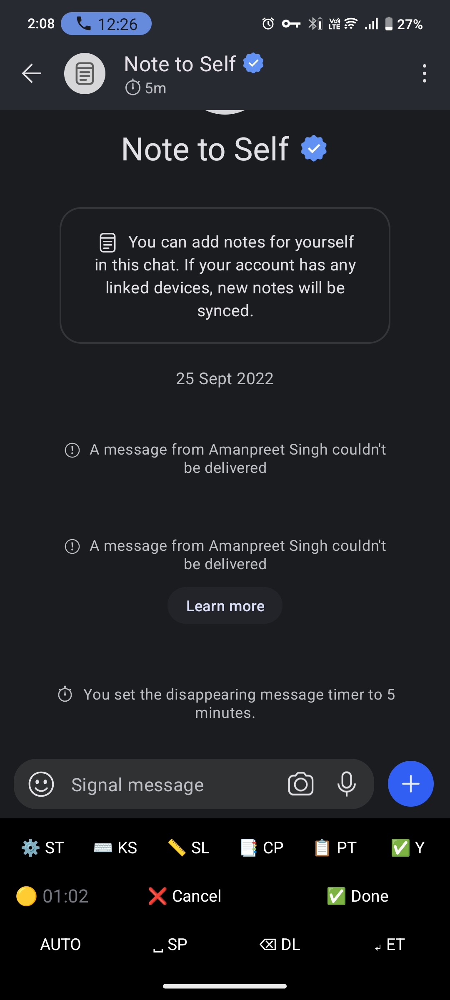
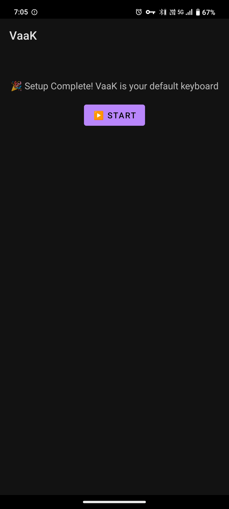
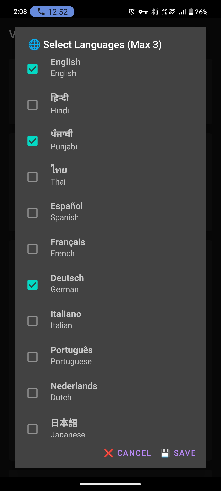
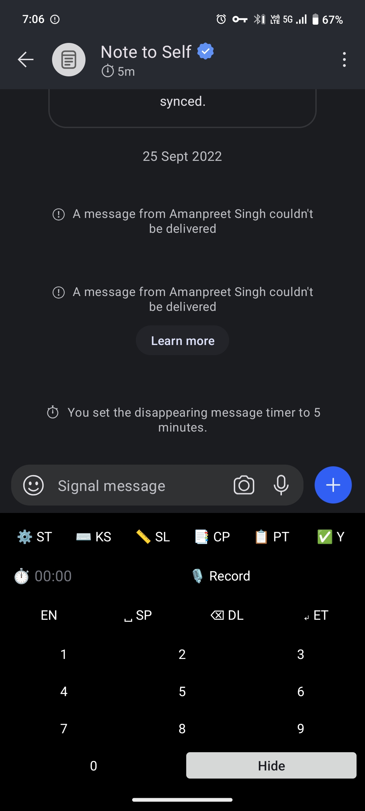
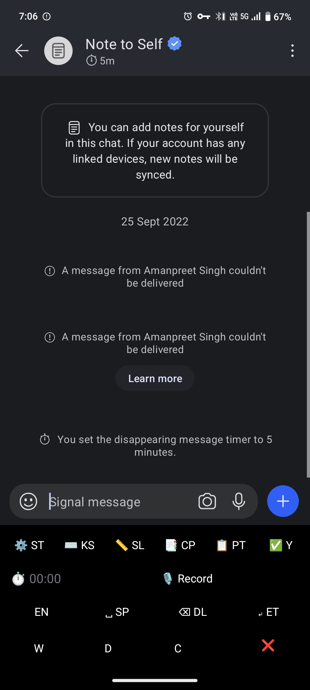
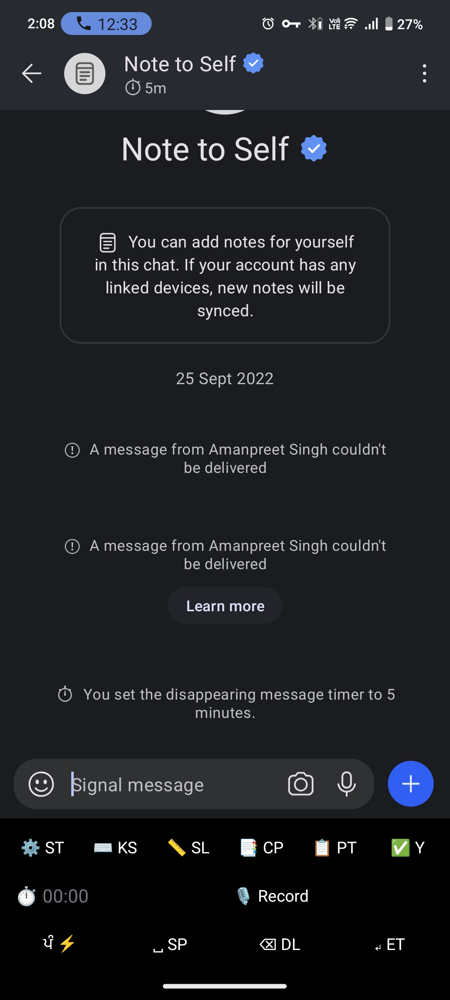
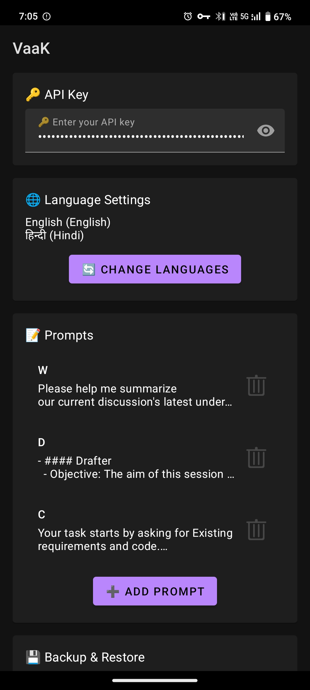
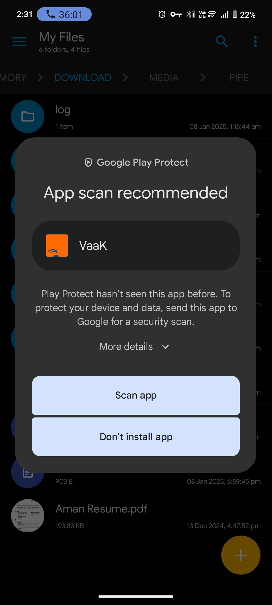

# VaaK - AI-Powered Voice Keyboard

Transform your typing experience with VaaK, an intelligent Android keyboard that brings the power of AI-driven voice dictation to your fingertips.

<div align="center">
  
  <br/>
  <em>AI-powered voice dictation with real-time feedback</em>
</div>

## What is VaaK?

VaaK (derived from ਵਾਕ, the Punjabi word for "utterance" or "speech") is an innovative Android keyboard that seamlessly integrates OpenAI's advanced speech recognition technology. It's designed to make text input more natural, efficient, and accessible through high-quality voice dictation.

## Why VaaK?

In today's fast-paced digital world, traditional typing can be a bottleneck in our communication. While voice input isn't new, existing solutions often struggle with accuracy, language support, and ease of use. We built VaaK to address these challenges by combining:

- State-of-the-art AI speech recognition
- Privacy-focused design
- Intuitive user experience
- Seamless keyboard integration

Our philosophy is simple: voice input should be as natural and reliable as typing, without compromising on privacy or user control.

⭐️ Please Star [GitHub Repo](https://github.com/amanhigh/vaak) if you like it!

## Core Features

### 1. Voice Dictation
- One-touch push-to-talk dictation
- Support for multiple languages
- Real-time transcription with visual feedback
- Smart timing feedback (green→yellow→red) for longer recordings
- Continuous dictation for longer texts

### 2. Smart Keyboard
- Seamless switching between voice and text input
- Quick switch to system keyboard (single tap)
- Rich clipboard management (copy, paste, select all)
- Convenient numpad for number entry
- Standard keyboard functionality when needed

### 3. Language & Translation
- Multi-language voice recognition
- Real-time translation capabilities
- Language auto-detection
- Quick language switching

### 4. Prompt Library
- Save and manage frequently used text snippets
- Quick access to saved prompts
- Edit and organize prompts
- One-tap prompt insertion

### 5. User Experience
- Clear status notifications
- Visual feedback during dictation
- Comprehensive error handling
- Intuitive controls and layouts

## Advanced Features
- Smart recording duration management with color-coded feedback
- Quick actions and keyboard shortcuts
- Backup and restore settings
- Customizable language preferences

## Planned Features
- Text rewording via AI mini models
- Usage statistics dashboard
  * Track transcription time
  * Monitor translation usage
  * Estimate API costs
- Developer Guide
- Enhanced Settings
- Improved Logo Design
- Improved Test Suite
- Playstore Submission

## Screenshots

### Core Features
<div align="center">
  <table>
    <tr>
      <td></td>
      <td></td>
      <td></td>
    </tr>
    <tr>
      <td><em>Setup Wizard</em></td>
      <td><em>Recording States</em></td>
      <td><em>Language Selection</em></td>
    </tr>
  </table>
</div>

### Advanced Features
<div align="center">
  <table>
    <tr>
      <td></td>
      <td></td>
      <td></td>
      <td></td>
    </tr>
    <tr>
      <td><em>Numpad Mode</em></td>
      <td><em>Prompts Library</em></td>
      <td><em>Translation Mode</em></td>
      <td><em>Settings</em></td>
    </tr>
  </table>
</div>

## Getting Started

### 1. Installation
- Download VaaK from the 📥 [Release](https://github.com/amanhigh/vaak/releases) Section of Github
- Install Android application (Need to allow scan and install for downloaded APK).

<div align="center">
  
</div>

### 2. Initial Setup
1. Open VaaK after installation
2. Follow the setup wizard to:
   - Enable VaaK as an input method
   - Grant required permissions
   - Configure basic settings.

### 3. API Key Configuration
1. Get an OpenAI API key from [OpenAI's website](https://openai.com)
2. Enter the API key in VaaK's settings
3. Verify the connection by trying a Recording.

### 4. Basic Usage
1. Switch to VaaK keyboard using your device's keyboard selector
2. Tap the microphone button to start dictation
3. Speak clearly into your device's microphone
4. Tap again to complete dictation

### 5. Advanced Usage

#### Language Controls 🌐
- **Quick Language Cycling**: Tap language button to cycle through:
  * Auto-detect (AUTO)
  * Your favorite languages (e.g., EN, हि, ਪੰ)
  * Back to auto-detect
- **Translation Mode**: Long press language button to:
  * Enable translation (shows ⚡️ indicator)
  * Disable translation
  * Translation language matches current input language
- **Configure Languages**: Set up to 3 favorite languages in settings

#### Hidden Features ⌨️
- **Numpad Access**: Long press SPACE to open number pad
- **Prompt Library**: Long press PASTE to access saved prompts
- **Quick Delete**: Hold Backspace for continuous text deletion
- **Quick Response**: Tap YES for "Yes, Let's Proceed"
- **Previous Keyboard**: Quick tap keyboard switch button to return to previous keyboard
- **All Keyboards**: Long press keyboard switch button to see all available keyboards

#### Smart Recording 🎙️
- **Quick Recordings**: Long press microphone button to start recording, release to complete - perfect for short recordings
- **Duration Feedback**: Recording timer changes color to indicate duration:
  * 🟢 Green: Start of recording
  * 🟡 Yellow: Medium duration
  * 🔴 Red: Long recording

## FAQ

**Q: What permissions does VaaK need?**  
A: VaaK requires microphone access for dictation, internet access for AI processing, and notification permissions for status updates.

**Q: Which languages are supported?**  
A: VaaK supports multiple languages including English, Punjabi, Hindi, Spanish, French, German, Italian, Portuguese, Dutch, Japanese, Korean, and Chinese.

**Q: How is my voice data handled?**  
A: Voice data is processed in real-time and is not stored permanently. All processing is done through OpenAI's secure API.

**Q: What happens if I lose internet connection?**  
A: VaaK will notify you of connection issues and continue functioning as a regular keyboard until connection is restored.

## Privacy & Security

We take your privacy seriously:

- Voice data is processed in real-time and not stored
- API keys are securely encrypted on your device
- No user data is collected or shared
- All permissions are used only for essential functionality

## Development Setup

For contributors who want to build and run VaaK from source.

### 1. Prerequisites

| Requirement | Version | Notes |
|---|---|---|
| JDK | 17 | `sourceCompatibility` and `jvmTarget` are both 17 |
| Android SDK | Platform 34 + Build Tools 34 | `compileSdk`/`targetSdk` are 34, `minSdk` is 24 |
| Gradle | not needed | the wrapper (`./gradlew`) downloads Gradle 8.11.1 on first run |
| `make` | any | all workflows are wrapped in the `Makefile` |
| `adb` | Android platform tools | only needed to install onto a device/emulator |

An Android device or emulator running Android 7.0+ is required to actually use the
keyboard — there is no desktop or web build.

### 2. Clone and Point at the Android SDK

```bash
git clone https://github.com/amanhigh/vaak.git
cd vaak
chmod +x gradlew
```

Configure the SDK location using **either** environment variables:

```bash
export ANDROID_HOME="$HOME/Android/Sdk"    # macOS: $HOME/Library/Android/sdk
export PATH="$ANDROID_HOME/platform-tools:$PATH"
```

**or** a `local.properties` file in the repo root (git-ignored, machine specific):

```properties
sdk.dir=/absolute/path/to/Android/Sdk
```

If the SDK is not installed yet, the command line tools can fetch it headlessly:

```bash
sdkmanager "platform-tools" "platforms;android-34" "build-tools;34.0.0"
sdkmanager --licenses    # licenses must be accepted or the build fails
```

There are no other environment variables and no `.env` file: the project has no
backend of its own, and all library dependencies are resolved by Gradle from Google's
Maven repo and Maven Central on the first build.

### 3. Build, Test and Install

```bash
make test      # unit tests (JUnit 5 + Mockito)
make lint      # Detekt static analysis
make format    # Spotless/ktlint auto-format, run before committing
make build     # format, then build the APK
make setup     # test + build + copy APK to ./vaak.apk
make install   # setup + adb install onto the connected device/emulator
make cover     # tests + Kover coverage report under app/build/reports/kover
make help      # list every target
```

The debug APK lands at `app/build/outputs/apk/debug/app-debug.apk` and is copied to
`./vaak.apk`. To install it manually: `adb install -r vaak.apk`.

CI runs `make setup`, so a green `make setup` locally means a green build.

### 4. Run It on the Device

VaaK is an input method, so launching it from the app icon only opens the setup
wizard — the keyboard itself is activated by the system:

1. Launch **VaaK** and follow the setup wizard.
2. Enable VaaK under *Settings → System → Languages & input → On-screen keyboards*.
3. Grant the microphone and notification permissions when prompted.
4. Enter your OpenAI API key in VaaK's settings screen (see below).
5. Open any text field, pick VaaK from the keyboard selector, and tap the microphone.

### 5. OpenAI API Key

The API key is not a build-time secret and is never stored in the repository. It is
entered at runtime on the settings screen and persisted on-device with
`EncryptedSharedPreferences`, so every developer supplies their own key from
[OpenAI](https://platform.openai.com/api-keys). Dictation and translation fail with an
invalid-API-key error until one is set.

### 6. Dev Container (optional)

A VS Code dev container with the Android SDK and an emulator is provided: open the
repo in VS Code and choose **Reopen in Container**. It builds from
`.devcontainer/Dockerfile`, starts an emulator container reachable over `adb` at
`localhost:5555` (VNC at <http://localhost:6080>), and runs
`.devcontainer/post-create.sh` to connect `adb` to it.

### 7. Project Layout

```
app/src/main/java/com/aman/vaak/
├── handlers/      # Android entry points: VaakInputMethodService (the keyboard),
│                  # VaakSetupActivity (launcher), VaakSettingsActivity, dialogs
├── managers/      # business logic: DictationManager, WhisperManager (OpenAI),
│                  # SettingsManager, PromptsManager, BackupManager
├── models/        # data and state classes
└── VaakModule.kt  # Hilt dependency injection wiring
app/src/test/      # JUnit 5 unit tests mirroring the packages above
```

See `AGENTS.md` for architecture details and testing conventions.

## Support & Feedback

We're constantly improving VaaK and value your input:

- Report issues: [GitHub Issues](https://github.com/amanhigh/vaak/issues)
- Request features: Open a discussion on our GitHub repository
- Community: Join our discussions and help improve VaaK

*Note: Some features may require specific Android versions or device capabilities.*
